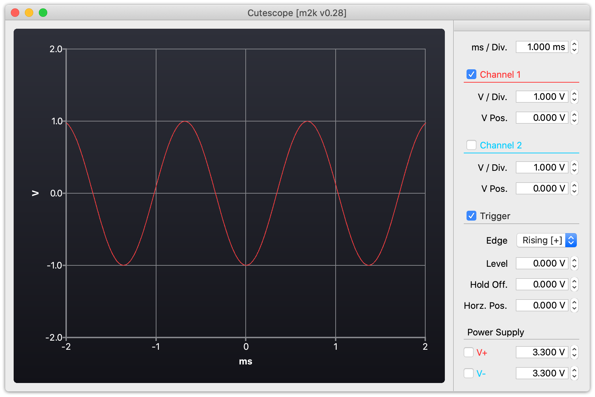

Cutescope
=========

[libm2k]: https://github.com/analogdevicesinc/libm2k
[libiio]: https://github.com/analogdevicesinc/libiio

Qt based oscilloscope app for Analog Devices ADALM2000 using [libm2k][libm2k] and [iio][libiio].

Building
--------

Just run `build.sh` adjusting `extsrcdir` variable pointing to root directory containing [libm2k][libm2k] and [iio][libiio] sources.

**WARNING** This software was so far only developed, built and tested on macOS Catalina 10.15.7.

Screenshots
-----------

License
-------

This software is released under [GPL v3](LICENSE) license, see [LICENSE](LICENSE) for full text.

Copyright &copy; 2022 Adam Strzelecki, All rights reserved.
